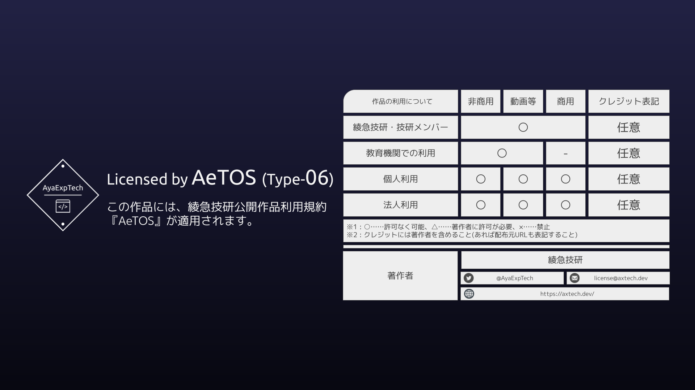

# AXT-func.js

綾急技研制作のJavaScript便利関数詰め合わせセットです。  
数行程度でかけたり、頻出したりする関数や定数などをまとめています。

なるべくワンライナーで書いているのでパクる参考になるかもしれません。

## バージョン

- このバージョン : `ver 1.1.0-beta.3`
- 最新のリリース : `ver 1.0.1`

## 使い方

jsDelivrで`https://cdn.jsdelivr.net/gh/AyaExpTech/AXT-func.js@vX.Y.Z/AXT-func.js`で参照できます。  
`X`, `Y`, `Z`はバージョンに応じて変更してください。

バージョン表記はセマンティックバージョニングに準拠します。  
また、開発中のbeta版のバージョン表記は`ver X.Y.0-beta.N`とします。(Nは1スタートの自然数)

`$AXT`の中に全部詰め込んでます。  
詳しくはwikiを見ろ！そこにリファレンスは全部書く！

また、特定関数のみが欲しい場合はその行の関数をコピペしても良いかもしれません。  
なるべくワンライナー(1行)で書いているためコピーはしやすいはずです。

## 対応環境

- 最新のGoogle Chromeで検証しています。
- たぶんSafari, FirefoxとChromiumベースの諸ブラウザ(Edge, Operaなど)でも動きます。動かなかったら教えて下さい。
- Internet Explorerは死にました。対応するつもりなどありません。Edgeを使え。

## 規約

Author : 綾急技研 (AyaExpTech)   
Licensed by "AeTOS(Type-06)"

## 変更履歴

リリースバージョン単位です。  
ただし、最新のリリースバージョンのあとのβ版は記載します。

### ver 1.1.0-beta.3 (2022-01-13)

- 関数追加
    - $AXT.math.quadratic - 二次方程式 ax²+bx+c=0 の実数解をすべて求めます。

### ver 1.1.0-beta.2 (2022-01-12)

- 関数追加
    - $AXT.math.root - iのj乗根を計算します。jの指定がない場合はiの平方根を計算します。

### ver 1.1.0-beta.1 (2022-01-12)

- beta版ブランチを作成

### ver 1.0.1 (2022-01-12)

- README.mdの修正
    - 日付間違えてました

### ver 1.0.0 (2022-01-12)

- minify版の追加
    - 毎回追加するとは限りません。更新時には変更履歴に記述します。
    - 概ねセマンティックバージョニングのマイナーバージョン(Y)更新ごとに対応する……と思います。気分です。
- 関数追加
    - $AXT.is.nullish - nullish(nullかundefined)か判定する
    - $AXT.func.sleep - awaitとともに使って指定秒数実行を止める。

### ver 0.9.1 (2022-01-12)

- 関数追加
    - $AXT.get.serialArray - `[0, 1, 2]`みたいな連番配列の生成。
    - $AXT.math.distance - 平面上2点間の直線距離を求める。
    - $AXT.is.object - 値がオブジェクトか判定する。
    - $AXT.is.primitive - 値がプリミティブか判定する。
    - $AXT.is.falsy - 値がfalsyか判定する。
    - $AXT.is.truthy - 値がtruthyか判定する。
    - $AXT.is.existItem - 指定した値が別に指定した値一覧のいずれかと一致するか判定する。

### ver 0.9.0 (2022-01-12)

- リポジトリを作成